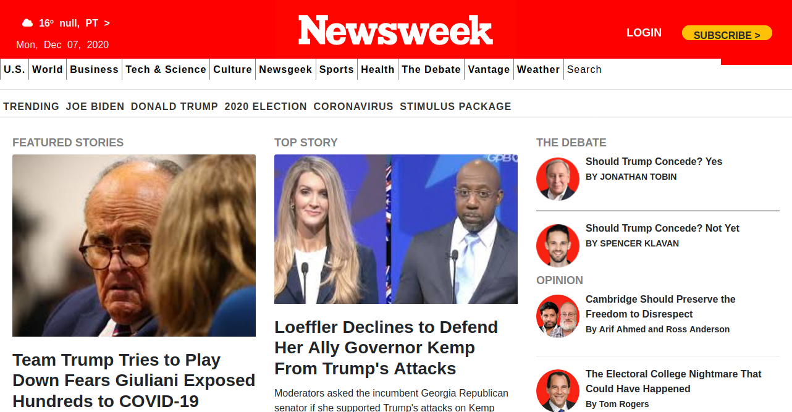

# Project 3: Using Bootstrap

> Recreation of Newsweek website using Twitter Bootstrap framework.

> This project is an attempt to recreate a Website called Newsweek using HTML, CSS, applying position concepts and UX principles achieving a responsive website and built with twitter bootstrap framework.

## Built with

- HTML, CSS and Bootstrap

## Live Demo

[LiveDemo-Link](https://leandro-barretoo.github.io/project3-bootstrap/)

## Authors

:bust_in_silhouette: **Author 1**

- GitHub: [@Leandro-Barretoo](https://github.com/Leandro-Barretoo)
- Twitter: [@Leandro74972596](https://twitter.com/Leandro74972596)
- LinkedIn: [LinkedIn](https://www.linkedin.com/in/leandro-miguel-gon%C3%A7alves-barreto-7079b11ba/)

:bust_in_silhouette: **Author 2**

- GitHub: [@jebitok-dev](https://github.com/jebitok-dev/)
- Twitter: [@Jsebitok](https://twitter.com/Jsebitok/)
- LinkedIn: [LinkedIn](https://www.linkedin.com/in/sharon-jebitok/)

## :thumbsup: Contributing

1. Fork it (<https://github.com/Leandro-Barretoo/project3-bootstrap/fork>)
2. Create your feature branch (`git checkout -b <branch-name>`)
3. Commit your changes (`git commit -m "Descriptive change"`)
4. Push to the branch (`git push -u origin <branch-name>`)
5. Create a new Pull Request

## Show your support

Give a :star: if you like this project!

## Acknowledgments

- Odin's Project Positioning Lessons
- Bootstrap Documentation

## :page_with_curl: License

This project is [MIT](https://opensource.org/licenses/MIT) licensed.
